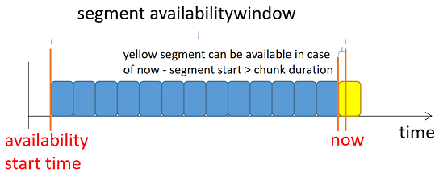

# Low Latency DASH from player perspective

## 1. Client Time Synchronization

UTCTiming element defined in MPD specifies a time source that can be used to adjust  the client clock for calculations that involve the client’s wallclock time such as segment availability calculations and latency calculations, etc.

```
<UTCTiming schemeIdUri="urn:mpeg:dash:utc:http-iso:2014" value="./game25006_hd_cmaf_number.isotime" />
```

Normally, time offset can be calculated by UTCTiming (request only once):

	time offset = Now@client - UTCTiming@server


## 2. Live edge calculation

Although there are SegmentBase and SegmentList to describe playlist of AdapatationSet/Representation, these 2 types are rarely used practically, so only 2 cases of SegmentTemplate (time/number) are mentioned here.

According to DASH IOP [9.7. Determining the live edge](https://dashif-documents.azurewebsites.net/DASH-IF-IOP/master/DASH-IF-IOP.html#live-edge-calculation), live edge can be calculated as:

	    live edge = availability_end - MPD@maxSegmentDuration

Where availability_end is end position of availability window, and availability window is like this:


* TotalAvailabilityTimeOffset is the sum of all @availabilityTimeOffset values that apply to the representation 

Practially For SegmentTemplate time case, the end time of last segment of last period is treated as availability_end.

In order to reduce start  load latency, DASH introduced availabilityTimeOffset.

| item                     | Remark                                                       |
| ------------------------ | ------------------------------------------------------------ |
| availabilityTimeComplete | specifies if all Segments of all associatedRepresentation are complete at the adjusted availability start time.<br />Set to "false" for low latency case to indicate segment may not be finished when it becomes available. |
| availabilityTimeOffset   | specifies an offset to define the adjusted segment <br />To signal the segment availability once the first chunk is completed, set to (SegmentTemplate@duration - Chunk duration)<br /> |

For example:

**SegmentTemplate number case**

```
<?xml version="1.0" encoding="utf-8" ?>
<!--Endeavor Streaming Server 6.3.8.20200519.28326 -->
<MPD type="dynamic" maxSegmentDuration="PT2.000S" minBufferTime="PT1.000S"
    minimumUpdatePeriod="PT3M20.000S" suggestedPresentationDelay="PT12.000S" 
    timeShiftBufferDepth="PT6.000S" availabilityStartTime="1970-01-01T00:00:00Z">
    <Period id="B583433BF94A42479DB816CC56631482" start="PT445062H9M39.468S">
        <AdaptationSet id="0" contentType="video" mimeType="video/mp4" segmentAlignment="true" startWithSAP="1" subsegmentAlignment="true" subsegmentStartsWithSAP="1">
            <SegmentTemplate timescale="1000000" presentationTimeOffset="1602223779468329" availabilityTimeComplete="false" availabilityTimeOffset="1.800000" duration="2000000" startNumber="801111868" media="$RepresentationID$-$Number$.cm4s" initialization="$RepresentationID$-init.m4s" />
            <Representation width="400" height="224" frameRate="30000/1001" sar="1:1" codecs="avc1.4D400D" id="game25006_hd_400_video" bandwidth="400000" />
            <Representation width="640" height="360" frameRate="30000/1001" sar="1:1" codecs="avc1.4D401E" id="game25006_hd_800_video" bandwidth="800000" />
            <Representation width="960" height="540" frameRate="30000/1001" sar="1:1" codecs="avc1.4D401F" id="game25006_hd_1600_video" bandwidth="1600000" />
            <Representation width="1280" height="720" frameRate="30000/1001" sar="1:1" codecs="avc1.4D4020" id="game25006_hd_3000_video" bandwidth="3000000" />
        </AdaptationSet>
    </Period>
    <UTCTiming schemeIdUri="urn:mpeg:dash:utc:http-iso:2014" value="./game25006_hd_cmaf_number.isotime" />
</MPD>
```

- Normal player
  * now = (2020-10-13T08:11:06.069263Z) = 1602576666.069263
  * availability window start point = 1602576666.069263 - 6 = 1602576660.069263
  * availability window end point = 1602576666.069263
  * Live edge = 1602576666.869263 - MPD@maxSegmentDuration - MPD@suggestedPresentationDelay = 1602576652.869263
  * Segment index to start = SegmentTemplate@startNumber + (Live edge - Period@start) / SegmentTemplate@duration = 801111868 + (1602576652.869263 - 1602223779.468)/2 = 801111868 + 176436 = 801288304
- Low latency player	
  * now = (2020-10-13T08:11:06.069263Z) = 1602576666.069263
  * availability window start point = 1602576666.069263 - 6 = 1602576660.069263
  * availability window end point = 1602576666.069263 + SegmentTemplate@AvailabilityTimeOffset = 1602576667.869263
  * Live edge = 1602576667.869263 - MPD@maxSegmentDuration = 1602576665.869263
  * Segment index to start = SegmentTemplate@startNumber + (Live edge - Period@start) / SegmentTemplate@duration = 801111868 + (1602576665.869263 - 1602223779.468)/2 = 801111868 + 176443 = 801288311
- Time difference = 1602576665.869263 - 1602576652.869263 = 13s

**SegmentTemplate time case** 

<TBD>


## 3. Wallclock Time Mapping

The Producer Reference Time supplies times corresponding to the production of associated media. This information permits among others to:

-  provide media clients with information to enable consumption and production to proceed at equivalent rates, thus avoiding possible buffer overflow or underflow
- enable measuring and potentially controlling the latency between the production of the media time and the playout. 

This can be achieved by specifying a so-called *Producer Reference Time* either in the segments (i.e. inband as prft box (defined in ETSI TS 126 247 [G.5 Producer reference box](https://www.etsi.org/deliver/etsi_ts/126200_126299/126247/12.03.00_60/ts_126247v120300p.pdf)) or in the MPD. 

```
<ProducerReferenceTime id="0" inband="true" type="encoder" wallclockTime="2020-02-19T10:42:02.667Z" presentationTime="1000">
	<UTCTiming schemeIdUri="urn:mpeg:dash:utc:http-xsiso:2014" value="http://time.akamai.com/?iso&ms" />
</ProducerReferenceTime>
```

- type can be "encoder" or "captured":

  - "encoder": wallclockTime of encoder output for frame at specific presentationTime, for calculation of Encoder-Display Latency (EDL) 
  - "captured": wallclockTime of encoder input for frame at specific presentationTime, for calculation of End-to-End Latency (EEL)

- set inband="true" to indicate "prft" box in segments:

  ```
  aligned(8) class ProducerReferenceTimeBox extends FullBox("srft", version, 0) {
   unsigned int(32) reference_track_ID;
   unsigned int(64) ntp_timestamp;
   if (version==0)
   {
   	unsigned int(32) media_time;
   } else
   {
   	unsigned int(64) media_time;
   }
  } 
  ```

- presentation latency PL of a presentation time PT presented at wall clock time WC in seconds  is determined as:

  ```
  PL = (ProducerReferenceTime@wallclockTime – UTCTiming@wallclockTime) - (ProducerReferenceTime@presentationTime – PTA)/TS.
  ```

  


## 4. Low Latency Service Description

A ServiceDescription element should be used to specify the service provider’s expectation.

- **Latency**: target latency and minimum/maximum latency boundaries in milliseconds. 

  | Item   | Description                                                  |
  | ------ | ------------------------------------------------------------ |
  | target | The service provider’s preferred presentation latency in milliseconds computed relative the producer reference time. |
  | max    | The service provider’s indication about the maximum presentation latency in milliseconds. **Indicates a content provider’s desire for the content <u>not to be presented</u> if the latency exceeds the maximum latency.** |
  | min    | The service provider’s indication about minimum presentation latency in milliseconds for example to avoid inconsistencies with second screen applications, overlays, etc. |

- **PlaybackRate**: playback rate boundaries may be specified that define the allowed range for playback acceleration/deceleration by the playout client to fulfill the latency requirements.

  | Item | Description                                                  |
  | ---- | ------------------------------------------------------------ |
  | max  | The maximum playback rate that the content provider indicates is appropriate for the purposes of automatically adjusting playback latency and buffer occupancy during normal playback, where 1.0 is normal playback speed. |
  | min  | The minimum playback rate that the content provider indicates is appropriate for the purposes of automatically adjusting playback latency and buffer occupancy during normal playback, where 1.0 is normal playback speed. |

So, for example, if following ServiceDescription defined in MPD:

```
<ServiceDescription id="0">
  <Latency target="3500" min="2000" max="10000"/>
  <PlaybackRate min="0.9" max="1.1"/>
</ServiceDescription>
```

player need to:

- Should seek to live when latency is larger than 10s
- Should change playback rate in range [0.9, 1.1] based on a algorithm when latency is no in [desired latency - tolerance, desired latency + tolerance]


## 5. Resynchronization Points

The previous post pointed out that chunked delivery decouples the achievable latency from the segment durations and enables us to choose relatively long segment durations to maintain good video encoding efficiency. In turn, this prevents fast quality adaptation of the player as quality switching can only be done on segment boundaries. In a low-latency scenario with low buffer levels, fast adaptation — especially down-switching — would be desirable to avoid buffer underruns and consequently playback interruptions.

To that end, Resync elements may be used that specify segment properties like chunk duration and chunk size. Playback clients can utilize them to locate resync point and

- Join streams mid-segment, based on latency requirements
- Switch representations mid-segment
- Resynchronize at mid-segment position after buffer underruns

The previous was a glimpse of what to expect in the near future and shows the great effort of the media industry put into kick-starting low-latency streaming with MPEG-DASH and getting it ready for production services. 
