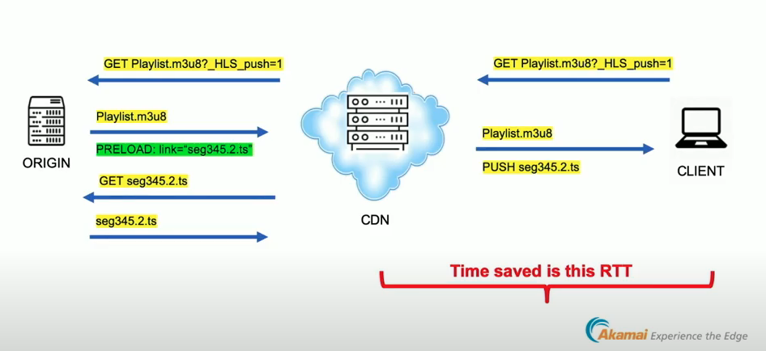

# Comparison of DASH-LL and LL-HLS

## Use of Chunked Transfer Encoding \(CTE\) 

DASH-LL uses CTE:

* One request per segment
* Deliver the sequential data in correct order
* Allow small chunk size \(down to 1 frame\)
* Difficult to estimate throughput bandwidth for ABR

While LL-HLS uses small independent chunk files:

* One request per chunk, multiple requests per segment
* Not that small chunk size \(suggested 1s per chunk\)
* Small chunk size also cause inaccurate estimation

## Partial Segment Description 

LL-HLS describes the the internal structure of segment/chunk for location of IDR frames \(“INDEPENDENT=YES”\), which can:

* Improve start-up
* Allow fast switching within a segment

LL-DASH introduces “Resync” tag for this. Currently no detailed document how it apply in practice.

## Request Rates to CDN 

According to test result of Akamai

* 6s segment, 0.3334 chunk/part
* DASH-LL: ~20 requests/min \(10 audios and 10 videos, manifest once only for template number case\)
* LL-HLS: ~720 requests/min \(audio playlist: 180, audio: 180, video playlist: 180, video: 180\)

##   References 

1. [Will Law - Three Roads to Jerusalem](https://www.youtube.com/watch?v=Col12gjnNlI)
2. [LL-HLS Series: How Does LL-HLS Work?](https://www.theoplayer.com/blog/how-does-ll-hls-work)

