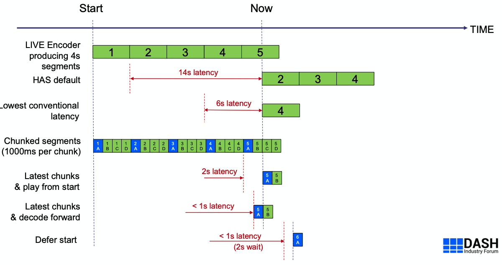
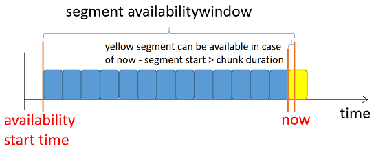
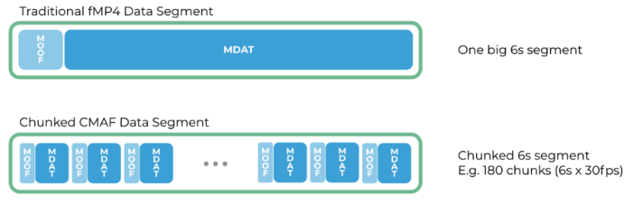

# DASH Low Latency from player perspective
{: .no_toc }

## Table of contents
{: .no_toc .text-delta }

1. TOC
{:toc}

---




4 noteworthy items from [DASH IF Guidelines on Low Latency](https://dashif.org/docs/CR-Low-Latency-Live-r8.pdf):

- At least one **UTCTiming** element with millisecond precision
* Two operational modes are permitted
  * **Simple live offering is used by applying @duration signaling and $Number$ based templating** (suggested)
  * Main live offering with the SegmentTimeline as either $Number$ or $Time$ is supported by the proposed updates in MPEG-DASH fourth edition. 

* At least one **ServiceDescription** element shall be present as follows: 
  * A Latency element - specifying min, target and max latencies
  * A PlaybackSpeed element – min, max playback speeds for latency correction. 
* A low latency adaption set can be built in two ways 
    * Using non-chunked segments whose duration < 30% of target latency 
    * Using chunked segments (CMAF)


## Client-Server Time Synchronization

UTCTiming element defined in MPD specifies a time source that can be used to adjust  the client clock for calculations that involve the client’s wallclock time such as segment availability calculations and latency calculations, etc.

```
<UTCTiming schemeIdUri="urn:mpeg:dash:utc:http-iso:2014" value="./game25006_hd_cmaf_number.isotime" />
```

Normally, time offset can be calculated by UTCTiming (**request only once**):

	time offset = UTCTiming@server - Now@client


## Live Edge Calculation

Although there are SegmentBase and SegmentList to describe playlist of AdapatationSet/Representation, these 2 types are rarely used practically, so only 2 cases of SegmentTemplate (time/number) are mentioned here.

According to DASH IOP [9.7. Determining the live edge](https://dashif-documents.azurewebsites.net/DASH-IF-IOP/master/DASH-IF-IOP.html#live-edge-calculation), live edge can be calculated as:

	    live edge = availability_end - MPD@maxSegmentDuration

Where availability_end is end position of availability window, and availability window is like this:


* TotalAvailabilityTimeOffset is the sum of all @availabilityTimeOffset values that apply to the representation 

Practially For SegmentTemplate time case, the end time of last segment of last period is treated as availability_end.

In order to reduce start  load latency, DASH introduced availabilityTimeOffset.

| item                     | Remark                                                       |
| ------------------------ | ------------------------------------------------------------ |
| availabilityTimeComplete | specifies if all Segments of all associatedRepresentation are complete at the adjusted availability start time.<br />Set to "false" for low latency case to indicate segment may not be finished when it becomes available. |
| availabilityTimeOffset   | specifies an offset to define the adjusted segment <br />To signal the segment availability once the first chunk is completed, set to (SegmentTemplate@duration - Chunk duration)<br /> |

For example:

**SegmentTemplate number case**

```
<?xml version="1.0" encoding="utf-8" ?>
<!--Endeavor Streaming Server 6.3.8.20200519.28326 -->
<MPD type="dynamic" maxSegmentDuration="PT2.000S" minBufferTime="PT1.000S"
    minimumUpdatePeriod="PT3M20.000S" suggestedPresentationDelay="PT12.000S" 
    timeShiftBufferDepth="PT6.000S" availabilityStartTime="1970-01-01T00:00:00Z">
    <Period id="B583433BF94A42479DB816CC56631482" start="PT445062H9M39.468S">
        <AdaptationSet id="0" contentType="video" mimeType="video/mp4" segmentAlignment="true" startWithSAP="1" subsegmentAlignment="true" subsegmentStartsWithSAP="1">
            <SegmentTemplate timescale="1000000" presentationTimeOffset="1602223779468329" availabilityTimeComplete="false" availabilityTimeOffset="1.800000" duration="2000000" startNumber="801111868" media="$RepresentationID$-$Number$.cm4s" initialization="$RepresentationID$-init.m4s" />
            <Representation width="400" height="224" frameRate="30000/1001" sar="1:1" codecs="avc1.4D400D" id="game25006_hd_400_video" bandwidth="400000" />
            <Representation width="640" height="360" frameRate="30000/1001" sar="1:1" codecs="avc1.4D401E" id="game25006_hd_800_video" bandwidth="800000" />
            <Representation width="960" height="540" frameRate="30000/1001" sar="1:1" codecs="avc1.4D401F" id="game25006_hd_1600_video" bandwidth="1600000" />
            <Representation width="1280" height="720" frameRate="30000/1001" sar="1:1" codecs="avc1.4D4020" id="game25006_hd_3000_video" bandwidth="3000000" />
        </AdaptationSet>
    </Period>
    <UTCTiming schemeIdUri="urn:mpeg:dash:utc:http-iso:2014" value="./game25006_hd_cmaf_number.isotime" />
</MPD>
```

- **Normal player**
  * now = (2020-10-13T08:11:06.069263Z) = 1602576666.069263
  * availability window start point = 1602576666.069263 - 6 = 1602576660.069263
  * availability window end point = 1602576666.069263
  * Live edge = 1602576666.869263 - MPD@maxSegmentDuration - MPD@suggestedPresentationDelay = 1602576652.869263
  * Segment index to start = SegmentTemplate@startNumber + (Live edge - Period@start) / SegmentTemplate@duration = 801111868 + (1602576652.869263 - 1602223779.468)/2 = 801111868 + 176436 = 801288304
- **Low latency player**	
  * now = (2020-10-13T08:11:06.069263Z) = 1602576666.069263
  * availability window start point = 1602576666.069263 - 6 = 1602576660.069263
  * availability window end point = 1602576666.069263 + SegmentTemplate@AvailabilityTimeOffset = 1602576667.869263
  * Live edge = 1602576667.869263 - MPD@maxSegmentDuration = 1602576665.869263
  * Segment index to start = SegmentTemplate@startNumber + (Live edge - Period@start) / SegmentTemplate@duration = 801111868 + (1602576665.869263 - 1602223779.468)/2 = 801111868 + 176443 = 801288311
- Time difference = 1602576665.869263 - 1602576652.869263 = 13s

**SegmentTemplate time case**: TBD

Pracitally, player can start very close to the live edge even without the low-latency techniques if the network can sustain it, or on the other hand, player can start further away from the live edge to allow initial bandwidth estimations using full media chunks for better user experience. 

Player can archieve latency target by [playbackRate adjustment](#service-description) after playback started.


## CMAF Chunked Delivery
Compared to an “ordinary” fMP4 segment that has its media payload in a single big mdat box, chunked CMAF allows segments to consist of a sequence of CMAF chunks (moof+mdat tuples). In extreme cases, every frame can be put into its own CMAF chunk. 

This enables the encoder to produce and the player’s decoder to consume segments in a chunk-by-chunk fashion instead of limiting use to entire segment consumption. 



So, player should support partial decoding.


## Service Description

A ServiceDescription element should be used to specify the service provider’s expectation.

- **Latency**: target latency and minimum/maximum latency boundaries in milliseconds. 

  | Item   | Description                                                  |
  | ------ | ------------------------------------------------------------ |
  | target | The service provider’s preferred presentation latency in milliseconds computed relative the producer reference time. |
  | max    | The service provider’s indication about the maximum presentation latency in milliseconds. **Indicates a content provider’s desire for the content <u>not to be presented</u> if the latency exceeds the maximum latency.** |
  | min    | The service provider’s indication about minimum presentation latency in milliseconds for example to avoid inconsistencies with second screen applications, overlays, etc. |

- [**PlaybackRate**][playbackRate]: playback rate boundaries may be specified that define the allowed range for playback acceleration/deceleration by the playout client to fulfill the latency requirements.

  | Item | Description                                                  |
  | ---- | ------------------------------------------------------------ |
  | max  | The maximum playback rate that the content provider indicates is appropriate for the purposes of automatically adjusting playback latency and buffer occupancy during normal playback, where 1.0 is normal playback speed. |
  | min  | The minimum playback rate that the content provider indicates is appropriate for the purposes of automatically adjusting playback latency and buffer occupancy during normal playback, where 1.0 is normal playback speed. |

So, for example, if following ServiceDescription defined in MPD:

```
<ServiceDescription id="0">
  <Latency target="3500" min="2000" max="10000"/>
  <PlaybackRate min="0.9" max="1.1"/>
</ServiceDescription>
```

player need to:

- Should seek to live when latency is larger than 10s
- Should change playback rate in range [0.9, 1.1] based on a algorithm when latency is no in [desired latency - tolerance, desired latency + tolerance]


## Bandwidth Estimation

One consequence of segment data being delivered as fast as it is produced is that the segment download time is ~equal to the segment duration. 

Conventional throughput estimation algorithms will always produce the answer that throughput equals bandwidth and hence the player will never switch up.

```
estimatedBW = downloadedSize / downloadDuration
```

Research for better ways to estimate bandwidth in chunked low-latency delivery scenarios is ongoing in academia and throughout the streaming:

- [BOLA](https://arxiv.org/pdf/1601.06748.pdf): chooses bitrate based on buffer level
  - Reference implementation: [BolaRule.js](https://github.com/Dash-Industry-Forum/dash.js/blob/development/src/streaming/rules/abr/BolaRule.js)
- [ACTE](https://dl.acm.org/doi/10.1145/3304112.3325611): a sliding window to accurately measure the available bandwidth and an online linear adaptive filter to predict the bandwidth into the future


## Presentation Latency Calculation

The Producer Reference Time supplies times corresponding to the production of associated media. This information permits among others to:

-  provide media clients with information to enable consumption and production to proceed at equivalent rates, thus avoiding possible buffer overflow or underflow
- enable **measuring and potentially controlling the latency** between the production of the media time and the playout. 

This can be achieved by specifying a so-called *Producer Reference Time* either in the segments (i.e. inband as prft box (defined in ETSI TS 126 247 [G.5 Producer reference box](https://www.etsi.org/deliver/etsi_ts/126200_126299/126247/12.03.00_60/ts_126247v120300p.pdf)) or in the MPD. 

```
<ProducerReferenceTime id="0" inband="true" type="encoder" wallclockTime="2020-02-19T10:42:02.667Z" presentationTime="1000">
	<UTCTiming schemeIdUri="urn:mpeg:dash:utc:http-xsiso:2014" value="http://time.akamai.com/?iso&ms" />
</ProducerReferenceTime>
```

- type can be "encoder" or "captured":

  - "encoder": wallclockTime of encoder output for frame at specific presentationTime, for calculation of Encoder-Display Latency (EDL) 
  - "captured": wallclockTime of encoder input for frame at specific presentationTime, for calculation of End-to-End Latency (EEL)

- set inband="true" to indicate "prft" box in segments:

  ```
  aligned(8) class ProducerReferenceTimeBox extends FullBox("srft", version, 0) {
    unsigned int(32) reference_track_ID;
    unsigned int(64) ntp_timestamp;
    if (version==0)
    {
   	  unsigned int(32) media_time;
    } else
    {
   	  unsigned int(64) media_time;
    }
  } 
  ```

- presentation latency PL of a presentation time PT presented at wall clock time WC in seconds  is determined as:

  ```
  PL = (ProducerReferenceTime@wallclockTime – UTCTiming@wallclockTime) - (currentPresentationTime - (ProducerReferenceTime@presentationTime – MPD@presentationTimeOffset)
  ```

Currently no (rare) player support it, instead, for the purpose of measuring latency, PL can be calculated as:

```
PL = Now@client + time offset - currentPresentationTime
```

- time offset = Now@client - UTCTiming@server which mentioned in 1. Client-Server Time Synchronization


## Resynchronization Points

Resync element permits the player to parse the segment to locate the Resynchronization Point. 

- Normally in **sidx box**:
  - This is most easily used for Segments that are fully available on the network.
  - So not very useful for live, especially low latency

```
aligned(8) class SegmentIndexBox extends FullBox("sidx", version, 0) {
 unsigned int(32) reference_ID;
 unsigned int(32) timescale;
 if (version==0)
 {
   unsigned int(32) earliest_presentation_time;
   unsigned int(32) first_offset;
 }
 else
 {
   unsigned int(64) earliest_presentation_time;
   unsigned int(64) first_offset;
 }
 unsigned int(16) reserved = 0;
 unsigned int(16) reference_count;
 for(i=1; i <= reference_count; i++)
 {
   bit (1) reference_type;
   unsigned int(31) referenced_size;
   unsigned int(32) subsegment_duration;
   bit(1) starts_with_SAP;
   unsigned int(3) SAP_type;
   unsigned int(28) SAP_delta_time;
 }
} 
```

- Signaling in the MPD 

  | Item  | Description                                                                       ||
  | ----- | ----------------------- | -------------------------------------------------------- |
  | dT    | On Adaptation Set level | providing the maximum and nominal duration of each chunk |
  |  | On Representation level | providing the maximum and nominal distance of two random access points |
  | dImax |On Adaptation Set level| providing the maximum size of a chunk. If unknown, parameter may be omitted. |
  |       | On Representation level | providing the maximum size of the data in between the two random access points. <br />If unknown, parameter may be omitted. |
  | dImin |On Adaptation Set level| providing the minimum size of a chunk. If unknown, parameter may be omitted. |
  |       | On Representation level | providing the minimum size of the data in between the two random access points. <br />If unknown, parameter may be omitted. |
  | type  |On Adaptation Set level| set to 0 to indicate that these are CMAF chunks without any promise for specific <br />random-access capabilities beyond parsing. |
  |       | On Representation level | set to 1, 2 or 3 to indicate that random access is possible. |

Resync elements specify segment properties like chunk duration and chunk size which player can utilize them to locate resync point and

- Join streams mid-segment, based on latency requirements
- Switch representations mid-segment
- Resynchronize at mid-segment position after buffer underruns

Resync element is defined in MPEG-DASH ISO/IEC 23009-1:2020/Amd.1, still on the way, don't know the details how it used in practice. 

```
[1]<Resync type="0" dT="500000" dImin="0.03125" dImax="0.09375" /> 
<SegmentTemplate timescale="1000000" duration="8000000" availabilityTimeOffset="7.500" availabilityTimeComplete="false" initialization="init-stream$RepresentationID$.m4s" media="chunk-stream$RepresentationID$-$Number%05d$.m4s" startNumber="1" />
<Representation id="0" mimeType="video/mp4" codecs="avc1.640016" bandwidth="500000" width="1280" height="720" sar="1:1" qualityRanking="5" />
...
<Representation id="3" mimeType="video/mp4" codecs="avc1.640016" bandwidth="300000" width="960" height="540" sar="1:1" qualityRanking="2">
	[2]<Resync type="2" dT="1000000" dImin="0.1" dImax="0.15" marker="TRUE" />
</Representation>
```

[1] Indicates that 

- The point is of type 0 - a CMAF chunk without any promise for specific random-access capabilities. 
- The maximum chunk duration is 500ms (500,000/1,000,000)
- The minimum distance in bytes between two Resynchronization Points is 15,625B (0.03125x500,000)
- The maximum distance in bytes between two Resynchronization Points is 46,875B (0.09375x500,000)

[2] Indicates that 

- The point is of type 2 – a CMAF chunk that can be used for fast access or switching 
- The maximum time delta between these points is 1s (1,000,000/1,000,000) 
- The minimum distance in bytes between two Resynchronization Points is 30,000B (0.1x300,000)
- The maximum distance in bytes between two Resynchronization Points is 45,000B (0.15x300,000) 
- As the @marker flag is set to true, a DASH client may search for the resync point using a box-parsing algorithm. 

## References
1. [DASH-IF-IOP](https://dashif-documents.azurewebsites.net/DASH-IF-IOP/master/DASH-IF-IOP.html)
1. [Low Latency Streaming: What is it and How can it be solved?](https://bitmovin.com/cmaf-low-latency-streaming/)
1. [Video Tech Deep-Dive: Live Low Latency Streaming Part 1](https://bitmovin.com/live-low-latency-streaming-p1/), [Video Tech Deep-Dive: Live Low Latency Streaming Part 2](https://bitmovin.com/live-low-latency-streaming-p2/)
1. [Low Latency DASH spec](https://dashif.org/docs/CR-Low-Latency-Live-r8.pdf)
1. [Meeting live broadcast requirements - the latest on DASH Low Latency](https://dvb.org/wp-content/uploads/2020/03/Latest-on-DASH-low-latency.pdf)