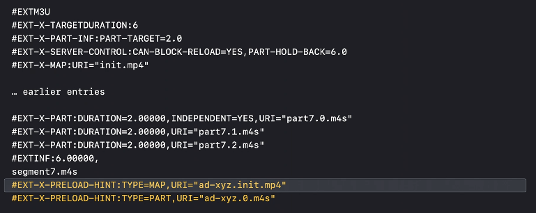
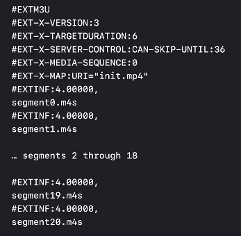
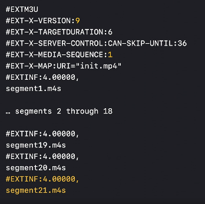
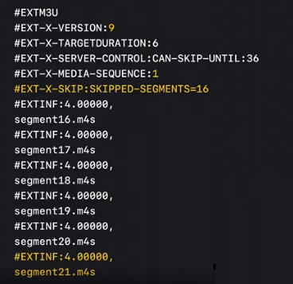
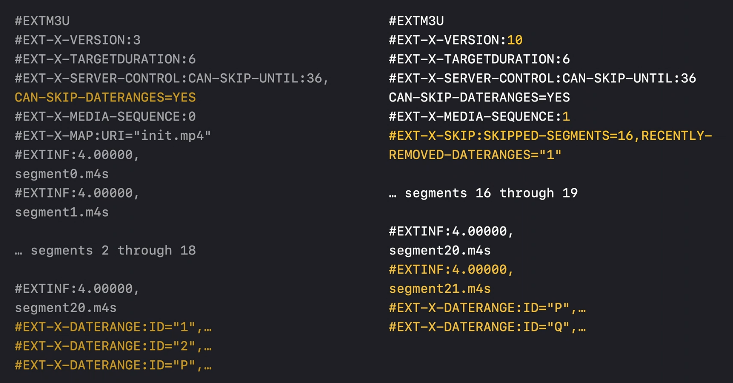
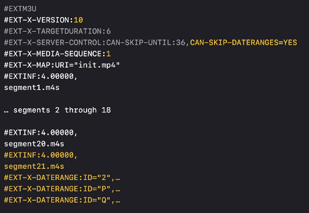

# Low Latency HLS from player perspective
{: .no_toc }


## Table of contents
{: .no_toc .text-delta }

1. TOC
{:toc}

---

## Delivery Directives

The `EXT-X-SERVER-CONTROL` tag allows the Server to indicate support for Delivery Directives:

| Item                | Description                                                  |
| ------------------- | ------------------------------------------------------------ |
| CAN-SKIP-UNTIL      | Indicates that the Server can produce Playlist Delta Updates in response to the _HLS_skip Delivery Directive.  Its value is the Skip Boundary, a decimal-floating-point number of seconds. The Skip Boundary MUST be at least six times the Target Duration. |
| CAN-SKIP-DATERANGES | A value of YES indicates that the Server can produce Playlist Delta Updates that skip older EXT-X-DATERANGE tags in addition to Media Segments. |
| HOLD-BACK           | The value is a decimal-floating-point number of seconds that indicates the server-recommended minimum distance from the end of the Playlist at which clients should begin to play or to which they should seek, unless PART-HOLD-BACK applies.  Its value MUST be at least three times the Target Duration.<br/>This attribute is OPTIONAL.  Its absence implies a value of three times the Target Duration.  It MAY appear in any Media Playlist. |
| PART-HOLD-BACK      | The value is a decimal-floating-point number of seconds that indicates the server-recommended minimum distance from the end of  the Playlist at which clients should begin to play or to which they should seek when playing in Low-Latency Mode.  Its value MUST be at least twice the Part Target Duration.  Its value SHOULD be at least three times the Part Target Duration.  If different Renditions have different Part Target Durations then PART-HOLD-BACK SHOULD be at least three times the maximum Part Target Duration. |
| CAN-BLOCK-RELOAD    | The value is an enumerated-string whose value is YES if the server supports Blocking Playlist Reload. |


## Live Edge Calculation

Similar with Latency@target of DASH-LL, `PART-HOLD-BACK` is the service provider’s preferred presentation latency, which can be used to calculate live edge. 

>  Player SHOULD NOT choose a segment closer to the end of the Playlist than described by the `HOLD-BACK` and `PART-HOLD-BACK` attributes.<sup>[1]</sup>

```
Find the part which:
- Calculate duration from last part reversely
- Find the start part which duration larger than PART-HOLD-BACK value and has INDEPENDENT=YES (Can be decoded independently, I-Frame)
```

For example:

```
#EXTM3U
# This Playlist is a response to: GET https://example.com/2M/waitForMSN.php?_HLS_msn=273&_HLS_part=2
#EXT-X-TARGETDURATION:4
#EXT-X-VERSION:6
#EXT-X-SERVER-CONTROL:CAN-BLOCK-RELOAD=YES,PART-HOLD-BACK=1.0,CAN-SKIP-UNTIL=12.0
#EXT-X-PART-INF:PART-TARGET=0.33334
#EXT-X-MEDIA-SEQUENCE:266
#EXT-X-PROGRAM-DATE-TIME:2019-02-14T02:13:36.106Z
#EXT-X-MAP:URI="init.mp4"
#EXTINF:4.00008,
fileSequence266.mp4
#EXTINF:4.00008,
fileSequence267.mp4
#EXTINF:4.00008,
fileSequence268.mp4
#EXTINF:4.00008,
fileSequence269.mp4
#EXTINF:4.00008,
fileSequence270.mp4
#EXT-X-PART:DURATION=0.33334,URI="filePart271.0.mp4"
#EXT-X-PART:DURATION=0.33334,URI="filePart271.1.mp4"
#EXT-X-PART:DURATION=0.33334,URI="filePart271.2.mp4"
#EXT-X-PART:DURATION=0.33334,URI="filePart271.3.mp4"
#EXT-X-PART:DURATION=0.33334,URI="filePart271.4.mp4",INDEPENDENT=YES
#EXT-X-PART:DURATION=0.33334,URI="filePart271.5.mp4"
#EXT-X-PART:DURATION=0.33334,URI="filePart271.6.mp4"
#EXT-X-PART:DURATION=0.33334,URI="filePart271.7.mp4"
#EXT-X-PART:DURATION=0.33334,URI="filePart271.8.mp4",INDEPENDENT=YES
#EXT-X-PART:DURATION=0.33334,URI="filePart271.9.mp4"
#EXT-X-PART:DURATION=0.33334,URI="filePart271.10.mp4"
#EXT-X-PART:DURATION=0.33334,URI="filePart271.11.mp4"
#EXTINF:4.00008,
fileSequence271.mp4
#EXT-X-PROGRAM-DATE-TIME:2019-02-14T02:14:00.106Z
#EXT-X-PART:DURATION=0.33334,URI="filePart272.a.mp4"
#EXT-X-PART:DURATION=0.33334,URI="filePart272.b.mp4"
#EXT-X-PART:DURATION=0.33334,URI="filePart272.c.mp4"
#EXT-X-PART:DURATION=0.33334,URI="filePart272.d.mp4"
#EXT-X-PART:DURATION=0.33334,URI="filePart272.e.mp4"
#EXT-X-PART:DURATION=0.33334,URI="filePart272.f.mp4",INDEPENDENT=YES
#EXT-X-PART:DURATION=0.33334,URI="filePart272.g.mp4"
#EXT-X-PART:DURATION=0.33334,URI="filePart272.h.mp4"
#EXT-X-PART:DURATION=0.33334,URI="filePart272.i.mp4"
#EXT-X-PART:DURATION=0.33334,URI="filePart272.j.mp4"
#EXT-X-PART:DURATION=0.33334,URI="filePart272.k.mp4"
#EXT-X-PART:DURATION=0.33334,URI="filePart272.l.mp4"
#EXTINF:4.00008,
fileSequence272.mp4
#EXT-X-PART:DURATION=0.33334,URI="filePart273.0.mp4",INDEPENDENT=YES
#EXT-X-PART:DURATION=0.33334,URI="filePart273.1.mp4"
#EXT-X-PART:DURATION=0.33334,URI="filePart273.2.mp4"
#EXT-X-PRELOAD-HINT:TYPE=PART,URI="filePart273.3.mp4"

#EXT-X-RENDITION-REPORT:URI="../1M/waitForMSN.php",LAST-MSN=273,LAST-PART=2
#EXT-X-RENDITION-REPORT:URI="../4M/waitForMSN.php",LAST-MSN=273,LAST-PART=1
```

- **Normal player**

  - `HOLD-BACK` is not defined, so by default start from the third segment from last (**fileSequence270.mp4**)

- **Low latency player**

  - `PART-HOLD-BACK`=1.0, means desired latency target is 1.0s

  - Calculate duration to 1.0s from last part ("**filePart273.2.mp4**") reversely, locate start part "**filePart273.0.mp4**"

    ```
    0.33334 + 0.33334 + 0.33334 > 1.0
    ```

  -  start with part "**filePart273.0.mp4**" as it has property "INDEPENDENT=YES"

    - Or need continue to find the one with "INDEPENDENT=YES"

- Time difference = 4.00008 + 4.00008 = 8s


## Preload hints and blocking of Media downloads

Eliminating unnecessary round trips is critical when delivering low-latency streams at global scale. 

In 2019, Apple have now also introduced HTTP2 Server Push into the HLS specifications. Essentially, the player should pass again via Query String, this time a boolean of *_HLS_push=1/0*, whether or not the most recent partial segment at the bottom of the m3u8 list should be pushed in parallel with the m3u8 response.

Historically, the HLS client would need to download the full m3u8 response, enumerate all the sequences and then only after that make a seperate HTTP request for the segment, often wasting several hundred milliseconds in the process.


CDNs will need to support HTTP2 push and be able to intrinsically understand which object to push along side a cached m3u8 response for this feature to be of significant value. Seems it not easy to adopt. <sup>[10]: 2:00</sup>

So Apple introduced a new tag, `EXT-X-PRELOAD-HINT`, to inform clients of upcoming Partial Segments and Media Initialization Sections. A client can issue a GET request for a hinted resource in advance; the server responds to the request as soon as the media becomes available.

```
#EXT-X-PRELOAD-HINT:<attribute-list>
```

| Item             | Description                                                  |
| ---------------- | ------------------------------------------------------------ |
| TYPE             | The value is an enumerated-string that specifies the type of the hinted resource.  If the value is PART, the resource is a Partial Segment.  If the value is MAP, the resource is a Media Initialization Section.  This attribute is REQUIRED. |
| URI              | The value is a URI identifying the hinted resource.  It MUST match the URI that will be subsequently added to the Playlist as a non-hinted resource. |
| BYTERANGE-START  | The value is the byte offset of the first byte of the hinted resource, from the beginning of the resource identified by the URI       attribute. This attribute is OPTIONAL.  Its absence implies a value of 0. |
| BYTERANGE-LENGTH | The value is the length of the hinted resource.  This attribute is OPTIONAL.  Its absence indicates that the last byte of the hinted       resource is the last byte of the resource identified by the URI attribute. |

For example:

```
#EXT-X-PART:DURATION=0.33334,URI="filePart273.0.mp4",INDEPENDENT=YES
#EXT-X-PART:DURATION=0.33334,URI="filePart273.1.mp4"
#EXT-X-PART:DURATION=0.33334,URI="filePart273.2.mp4"
#EXT-X-PRELOAD-HINT:TYPE=PART,URI="filePart273.3.mp4"
```

- After part "filePart273.2.mp4" is downloaded, player don't need to wait for playlist reload, instead, can try to get "filePart273.3.mp4" directly.

For SSAI case, "**TYPE=MAP** is needed for different initialization segment:




## Blocking of Playlist reload

To support efficient client notification of new Media Segments and Partial Segments, Low-Latency HLS introduces the ability to block a Playlist reload request. 

> Clients MUST NOT request Blocking Playlist Reloads unless the Playlist contains an `EXT-X-SERVER-CONTROL` tag with a CAN-BLOCK-RELOAD=YES attribute.

When a client issues an HTTP GET to request a Media Playlist update, it can add special query parameters called Delivery Directives to specify that it wants the Playlist response to include a future segment. The server then holds onto the request (blocks) until a version of the Playlist that contains that segment is available. Blocking Playlist Reloads eliminate Playlist polling.

| Item        | Description                                                  |
| ----------- | ------------------------------------------------------------ |
| _HLS_msn=M  | Player will get response until the Playlist contains any Partial Segment with a Media Sequence Number of M |
| _HLS_part=N | When the Playlist URI contains both an _HLS_msn directive and an _HLS_part directive, Player will get response until the Playlist contains any Partial Segment with Part Index N and with a Media Sequence Number of M |

Player can request playlist reload while requesting last part/segment in the playlist including preload-hints part.

For example:

```
#EXTM3U
#EXT-X-TARGETDURATION:4
#EXT-X-VERSION:6
#EXT-X-SERVER-CONTROL:CAN-BLOCK-RELOAD=YES,CAN-SKIP-UNTIL=24,PART-HOLD-BACK=3.012
#EXT-X-PART-INF:PART-TARGET=1.004000
#EXT-X-MEDIA-SEQUENCE:1077717
#EXT-X-MAP:URI="fileSequence18.mp4"
#EXTINF:3.98933,
fileSequence1078262.mp4
#EXTINF:3.98933,
fileSequence1078263.mp4
#EXT-X-PROGRAM-DATE-TIME:2020-10-15T09:26:00.708Z
#EXTINF:3.98933,
fileSequence1078274.mp4
#EXTINF:3.98933,
fileSequence1078275.mp4
#EXT-X-PART:DURATION=1.00267,URI="lowLatencySeg.mp4?segment=filePart1078276.1.mp4"
#EXT-X-PART:DURATION=1.00267,URI="lowLatencySeg.mp4?segment=filePart1078276.2.mp4"
#EXT-X-PART:DURATION=1.00267,URI="lowLatencySeg.mp4?segment=filePart1078276.3.mp4"
#EXT-X-PART:DURATION=0.98133,URI="lowLatencySeg.mp4?segment=filePart1078276.4.mp4"
#EXTINF:3.98933,
fileSequence1078276.mp4
#EXT-X-PART:DURATION=1.00267,URI="lowLatencySeg.mp4?segment=filePart1078277.1.mp4"
#EXT-X-PART:DURATION=1.00267,URI="lowLatencySeg.mp4?segment=filePart1078277.2.mp4"
#EXT-X-PART:DURATION=1.00267,URI="lowLatencySeg.mp4?segment=filePart1078277.3.mp4"
#EXT-X-PART:DURATION=0.98133,URI="lowLatencySeg.mp4?segment=filePart1078277.4.mp4"
#EXTINF:3.98933,
fileSequence1078277.mp4
#EXT-X-PART:DURATION=1.00267,URI="lowLatencySeg.mp4?segment=filePart1078278.1.mp4"
#EXT-X-PRELOAD-HINT:TYPE=PART,URI="lowLatencySeg.mp4?segment=filePart1078278.2.mp4"
#EXT-X-RENDITION-REPORT:URI="/cmaf/media0/lowLatencyHLS.m3u8",LAST-MSN=1074858,LAST-PART=3
#EXT-X-RENDITION-REPORT:URI="/cmaf/media1/lowLatencyHLS.m3u8",LAST-MSN=1074858,LAST-PART=3
#EXT-X-RENDITION-REPORT:URI="/cmaf/media2/lowLatencyHLS.m3u8",LAST-MSN=1074858,LAST-PART=3
```

- While requesting the preload hint part/segment (**"lowLatencySeg.mp4?segment=filePart1078278.2.mp4"**), player can request the playlist with query string (?HLS_msn=**1077723**&HLS_part=**3**)
  - "3" is the part number of segment needed 
    - As `EXT-X-TARGETDURATION` is 4 and `PART-TARGET` is 1.004000, so this segment is not finished
    - 2 parts had been revealed, next should be the 3rd one.
  - "1077717 + 6 = 1077723" is the sequence number of segment needed
    - As `EXT-X-TARGETDURATION` is 4 and `PART-TARGET` is 1.004000, so this segment is not finished
    - Or will move to next new segment 1077724


## Bandwidth Estimation

Similar with LL-DASH, transferring small sub-segment media pieces in the LL-HLS case likely suffers from [estimation inaccuracies caused by small transfer sizes](https://docs.google.com/document/d/1e3jVkZ6nxNWgCqTNibqV8uJcKo8d597XVl3nJkY7P8c/edit#heading=h.omecbu2809cn). <sup>[7]</sup>

According to preferences [6]/[7]:

> "Don't make the assumption that measurement errors are normally distributed independent of the transfer size, because small transfers (or transfers taking only a short time) seem to get a higher share of additional measurement errors and thus should be weighted even less. "

​	→ So need to filter out download data of small size in a short time. 

> "Account for the time taken to open the connection as this may include some of the transferred bytes already and gives an indication about the additional connection time needed for every request"

​	→ So try to reuse connection, or take connection time out of bandwidth calculation.

Currently no good ABR mentioned for LL-HLS, so it's all depends on bandwidth.


## Presentation Latency Calculation

No like LL-DASH with ProducerReferenceTime and Client-Server Time Synchronization, so player has to calculate live latency with:

- Based on `EXT-X-PROGRAM-DATE-TIME` in manifest

- Client-Server Time Synchronization manually (calculate time offset) or trust local system time (time offset = 0)

- Find the relative-absolute time mapping of startup part

  - Calculate Relative time which is the accumulated duration to start part

  - Calculate Absolute time by adding last `EXT-X-PROGRAM-DATE-TIME` to the accumulated duration after it

    > All Media Playlists have EXT-PROGRAM-DATE-TIME tags. <sup>[1]</sup>

  - TimeGap = Absolution time - Relative time

- PresentationTime = player@mediaTime + TimeGap

- Latency = Now@client + time offset (if any) - PresentationTime

For example:

```
#EXTM3U
#EXT-X-TARGETDURATION:4
#EXT-X-VERSION:6
#EXT-X-SERVER-CONTROL:CAN-BLOCK-RELOAD=YES,CAN-SKIP-UNTIL=24,PART-HOLD-BACK=3.012
#EXT-X-PART-INF:PART-TARGET=1.004000
#EXT-X-MEDIA-SEQUENCE:1090548
#EXT-X-MAP:URI="fileSequence52.mp4"
#EXTINF:4.00000,
fileSequence1091129.mp4
#EXTINF:4.00000,
fileSequence1091130.mp4
#EXT-X-PROGRAM-DATE-TIME:2020-10-16T02:53:01.265Z
#EXTINF:4.00000,
fileSequence1091131.mp4
#EXTINF:4.00000,
fileSequence1091132.mp4
#EXTINF:4.00000,
fileSequence1091133.mp4
#EXTINF:4.00000,
fileSequence1091134.mp4
#EXTINF:4.00000,
fileSequence1091135.mp4
#EXT-X-PROGRAM-DATE-TIME:2020-10-16T02:53:21.265Z
#EXTINF:4.00000,
fileSequence1091136.mp4
#EXTINF:4.00000,
fileSequence1091137.mp4
#EXTINF:4.00000,
fileSequence1091138.mp4
#EXTINF:4.00000,
fileSequence1091139.mp4
#EXTINF:4.00000,
fileSequence1091140.mp4
#EXT-X-PROGRAM-DATE-TIME:2020-10-16T02:53:41.265Z
#EXTINF:4.00000,
fileSequence1091141.mp4
#EXTINF:4.00000,
fileSequence1091142.mp4
#EXT-X-PART:DURATION=1.00000,INDEPENDENT=YES,URI="lowLatencySeg.mp4?segment=filePart1091143.1.mp4"
#EXT-X-PART:DURATION=1.00000,INDEPENDENT=YES,URI="lowLatencySeg.mp4?segment=filePart1091143.2.mp4"
#EXT-X-PART:DURATION=1.00000,INDEPENDENT=YES,URI="lowLatencySeg.mp4?segment=filePart1091143.3.mp4"
#EXT-X-PART:DURATION=1.00000,INDEPENDENT=YES,URI="lowLatencySeg.mp4?segment=filePart1091143.4.mp4"
#EXTINF:4.00000,
fileSequence1091143.mp4
#EXT-X-PART:DURATION=1.00000,INDEPENDENT=YES,URI="lowLatencySeg.mp4?segment=filePart1091144.1.mp4"
#EXT-X-PART:DURATION=1.00000,INDEPENDENT=YES,URI="lowLatencySeg.mp4?segment=filePart1091144.2.mp4"
→→ #EXT-X-PART:DURATION=1.00000,INDEPENDENT=YES,URI="lowLatencySeg.mp4?segment=filePart1091144.3.mp4"
#EXT-X-PART:DURATION=1.00000,INDEPENDENT=YES,URI="lowLatencySeg.mp4?segment=filePart1091144.4.mp4"
#EXTINF:4.00000,
fileSequence1091144.mp4
#EXT-X-PART:DURATION=1.00000,INDEPENDENT=YES,URI="lowLatencySeg.mp4?segment=filePart1091145.1.mp4"
#EXT-X-PART:DURATION=1.00000,INDEPENDENT=YES,URI="lowLatencySeg.mp4?segment=filePart1091145.2.mp4"
#EXT-X-PRELOAD-HINT:TYPE=PART,URI="lowLatencySeg.mp4?segment=filePart1091145.3.mp4"
#EXT-X-RENDITION-REPORT:URI="/cmaf/audio/lowLatencyHLS.m3u8",LAST-MSN=1093480,LAST-PART=1
#EXT-X-RENDITION-REPORT:URI="/cmaf/media0/lowLatencyHLS.m3u8",LAST-MSN=1090564,LAST-PART=1
#EXT-X-RENDITION-REPORT:URI="/cmaf/media2/lowLatencyHLS.m3u8",LAST-MSN=1090564,LAST-PART=1
```

- player will start playback from part "**lowLatencySeg.mp4?segment=filePart1091144.3.mp4**"
  - Relative time = 15 * 4 + 3 = 63s
  - Absolute time = 2020-10-16T02:53:41.265Z + (3 * 4 + 3) = 1602816821.265 + 15 = 1602816836.265
  - TimeGap = 1602816836.265 - 63 = 1602816773.265
- player@mediaTime = 70s
- Now@client = 1602816846.415, use local system time
- PresentationTime = 70 + 1602816773.265 = 1602816843.265
- Latency = 1602816846.415 - 1602816843.265 = 3.15s


## Generation of Partial Segments

Partial segments are advertised using a new `EXT-X-PART` tag.

- Only advertised for the most recent segments in the playlist to reduce Playlist bloat 

- Can be different files

  

- **Also can be a same file but at different byte ranges to save round-trips compared to making separate requests for each part**

  


## Playlist Delta Updates

Player transfer playlists more frequently with Low-Latency HLS. To reduce transfer cost by removing unnesseray duplicated contents,  `EXT-X-SKIP` tag is introduced to update replace a considerable portion of the Playlist that the client already has. 

> If a Media Playlist file contains an `EXT-X-SERVER-CONTROL` tag with a CAN-SKIP-UNTIL attribute and no EXT-X-ENDLIST tag, a Client MAY use the _HLS_skip Delivery Directive to request Playlist Delta Updates. 
>
> A Client SHOULD NOT request a Playlist Delta Update unless it already has a version of the Playlist that is no older than one-half of the Skip Boundary.
>
> The client can request a Playlist Delta Update that skips older Media Segments by adding an "_HLS_skip=YES" directive to the Media Playlist URL when it requests the Playlist.
>
> A Client MUST merge the contents of a Playlist Delta Update with its previous version of the Playlist to form an up-to-date version of the Playlist. 

| Item                        | Description                                                  |
| --------------------------- | ------------------------------------------------------------ |
| SKIPPED-SEGMENTS            | The value is the count of Media Segments were replaced by the `EXT-X-SKIP` tag.  This attribute is REQUIRED. |
| RECENTLY-REMOVED-DATERANGES | The value is a quoted-string consisting of a tab (0x9) delimited list of EXT-X-DATERANGE IDs that have been removed from the Playlist recently. |
| _HLS_skip                   | YES or v2<br />v2 for skip EXT-X-DATERANGE in case of CAN-SKIP-DATERANGES supported |

For example:

- First time, full playlist, saw **CAN-SKIP-UNTIL**
- Next time can request with ?_HLS_skip=YES
  - EXT-X-VERSION changed to 9
  - Skipped total 16 segments
  - EXT-X-MEDIA-SEQUENCE increased to 1 mean segment0.m4s is not available anymore
  - segment21.m4s is newly added
  - Player need to merge with previous playlist to get current playlist

⇒ ⇒ 

- For DATERANGE, need request with ?_HLS_skip=v2

  ⇒


## Rendition Reports

When playing at low latency, the client must be able to switch renditions with a minimum number of round trips in order to perform bit-rate adaptation. To support this, the server adds Rendition Reports on the other renditions in the Master Playlist to each Media Playlist. The `EXT-X-RENDITION-REPORT` tag carries a Rendition Report and provides information such as the last Media Sequence Number and Part currently in the Media Playlist of that rendition.

| Item      | Description                                                  |
| --------- | ------------------------------------------------------------ |
| URI       | The value is the URI for the Media Playlist of the specified Rendition.  It MUST be relative to the URI of the Media Playlist containing the `EXT-X-RENDITION-REPORT` tag.  This attribute is REQUIRED. |
| LAST-MSN  | The value is a decimal-integer specifying the Media Sequence Number of the last Media Segment currently in the specified Rendition.  If the Rendition contains Partial Segments then this value is the Media Sequence Number of the last Partial Segment. This attribute is REQUIRED. |
| LAST-PART | The value is a decimal-integer that indicates the Part Index of the last Partial Segment currently in the specified Rendition whose Media Sequence Number is equal to the LAST-MSN attribute value.  This attribute is REQUIRED if the Rendition contains a Partial Segment. |

> A server MAY omit adding an attribute to an EXT-X-RENDITION-REPORT tag - even a mandatory attribute - if its value is the same as that of the Rendition Report of the Media Playlist to which the EXT-X-RENDITION-REPORT tag is being added. <sup>[1]</sup>

- Consider last msn and part of target rendition in ABR algorithms such as:
  - Not switch to renditions LAST-MSN and LAST-PART smaller than current rendition even choosen by ABR algorithms
  - Encourage to switch to renditions LAST-MSN and LAST-PART larger than current rendition 
- Request the next rendition (?)

For example:

```
#EXTM3U
#EXT-X-TARGETDURATION:4
#EXT-X-VERSION:6
#EXT-X-SERVER-CONTROL:CAN-BLOCK-RELOAD=YES,CAN-SKIP-UNTIL=24,PART-HOLD-BACK=3.012
#EXT-X-PART-INF:PART-TARGET=1.004000
#EXT-X-MEDIA-SEQUENCE:1094098
#EXT-X-MAP:URI="fileSequence52.mp4"
...
#EXT-X-PROGRAM-DATE-TIME:2020-10-16T06:50:21.265Z
#EXTINF:4.00000,
fileSequence1094706.mp4
#EXTINF:4.00000,
fileSequence1094707.mp4
#EXT-X-PART:DURATION=1.00000,INDEPENDENT=YES,URI="lowLatencySeg.mp4?segment=filePart1094708.1.mp4"
#EXT-X-PART:DURATION=1.00000,INDEPENDENT=YES,URI="lowLatencySeg.mp4?segment=filePart1094708.2.mp4"
#EXT-X-PART:DURATION=1.00000,INDEPENDENT=YES,URI="lowLatencySeg.mp4?segment=filePart1094708.3.mp4"
#EXT-X-PART:DURATION=1.00000,INDEPENDENT=YES,URI="lowLatencySeg.mp4?segment=filePart1094708.4.mp4"
#EXTINF:4.00000,
fileSequence1094708.mp4
#EXT-X-PART:DURATION=1.00000,INDEPENDENT=YES,URI="lowLatencySeg.mp4?segment=filePart1094709.1.mp4"
#EXT-X-PART:DURATION=1.00000,INDEPENDENT=YES,URI="lowLatencySeg.mp4?segment=filePart1094709.2.mp4"
#EXT-X-PART:DURATION=1.00000,INDEPENDENT=YES,URI="lowLatencySeg.mp4?segment=filePart1094709.3.mp4"
#EXT-X-PART:DURATION=1.00000,INDEPENDENT=YES,URI="lowLatencySeg.mp4?segment=filePart1094709.4.mp4"
#EXTINF:4.00000,
fileSequence1094709.mp4
#EXT-X-PART:DURATION=1.00000,INDEPENDENT=YES,URI="lowLatencySeg.mp4?segment=filePart1094710.1.mp4"
#EXT-X-PART:DURATION=1.00000,INDEPENDENT=YES,URI="lowLatencySeg.mp4?segment=filePart1094710.2.mp4"
#EXT-X-PART:DURATION=1.00000,INDEPENDENT=YES,URI="lowLatencySeg.mp4?segment=filePart1094710.3.mp4"
#EXT-X-PRELOAD-HINT:TYPE=PART,URI="lowLatencySeg.mp4?segment=filePart1094710.4.mp4"
#EXT-X-RENDITION-REPORT:URI="/cmaf/audio/lowLatencyHLS.m3u8",LAST-MSN=1097040,LAST-PART=0
#EXT-X-RENDITION-REPORT:URI="/cmaf/media1/lowLatencyHLS.m3u8",LAST-MSN=1094113,LAST-PART=2
#EXT-X-RENDITION-REPORT:URI="/cmaf/media2/lowLatencyHLS.m3u8",LAST-MSN=1094114,LAST-PART=1
```

- Not switch to "/cmaf/media1/lowLatencyHLS.m3u8" as LAST-MSN 1094113 of it is smaller than of current rendition.


## References

1. [HLS specification](https://tools.ietf.org/html/draft-pantos-hls-rfc8216bis-07)
2. [Enabling Low-Latency HLS](https://developer.apple.com/documentation/http_live_streaming/enabling_low-latency_hls)
3. [Update: What is Low-Latency HLS and How Does It Relate to CMAF](https://www.wowza.com/blog/apple-low-latency-hls)
4. [Ultra-Low-Latency Streaming Using Chunked-Encoded and ChunkedTransferred CMAF](https://www.akamai.com/us/en/multimedia/documents/white-paper/low-latency-streaming-cmaf-whitepaper.pdf)
5. [Video Tech Deep-Dive: Live Low Latency Streaming Part 3 – Low-Latency HLS](https://bitmovin.com/live-low-latency-hls/)
6. [Low-latency live playback with ExoPlayer](https://docs.google.com/document/d/1z9qwuP7ff9sf3DZboXnhEF9hzW3Ng5rfJVqlGn8N38k)
7. [Bandwidth estimation analysis from ExoPlayer](https://docs.google.com/document/d/1e3jVkZ6nxNWgCqTNibqV8uJcKo8d597XVl3nJkY7P8c)
8. [Apple's implementation of Low Latency HLS Explained](https://www.linkedin.com/pulse/apples-implementation-low-latency-hls-explained-phil-harrison/)
9. [Will Law - Three Roads to Jerusalem](https://www.youtube.com/watch?v=Col12gjnNlI)
10. [What's new in Low-Latency HLS](https://developer.apple.com/videos/play/wwdc2020/10228)